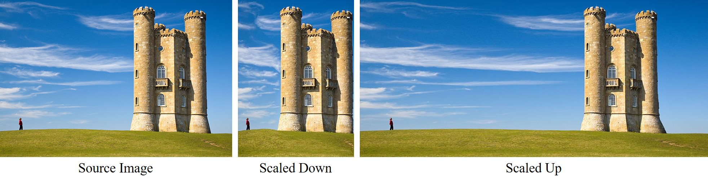
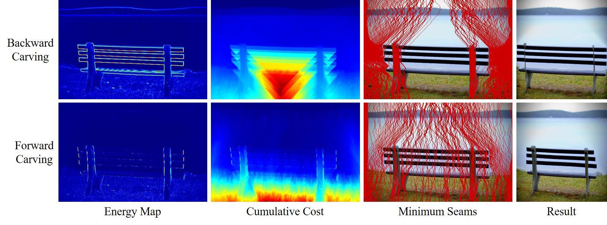
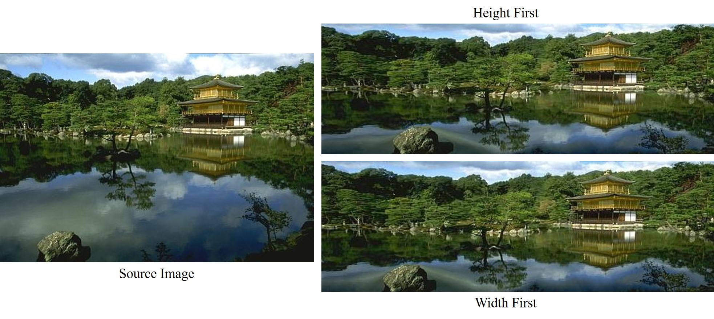
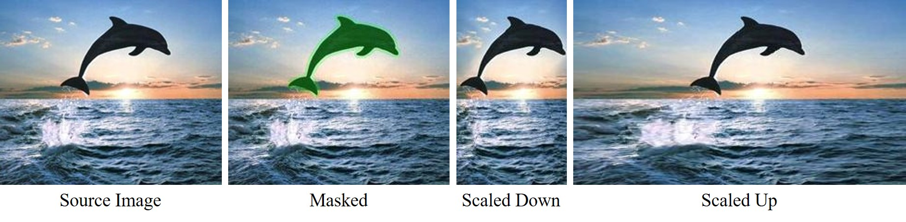
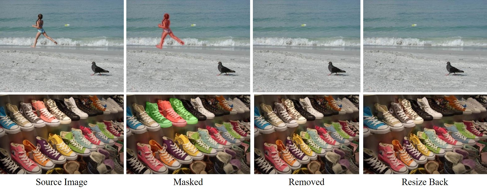

# Seam Carving

[](https://pypi.org/project/seam-carving/)
[](https://github.com/li-plus/seam-carving/actions)
[](https://github.com/li-plus/seam-carving/blob/master/LICENSE)
[](https://codecov.io/gh/li-plus/seam-carving)

A super-fast Python implementation of [Seam carving for content-aware image resizing](https://dl.acm.org/doi/abs/10.1145/1275808.1276390), and the forward energy function proposed in [Improved seam carving for video retargeting](https://dl.acm.org/doi/abs/10.1145/1360612.1360615).

With seam carving algorithm, the image could be intelligently resized while keeping the important contents undistorted. The carving process could be further guided, so that an object could be removed from the image without apparent artifacts.

## Installation

Install a stable version from PyPI.

```shell script
pip install seam-carving
```

Or install the latest version from GitHub.

```shell script
pip install git+https://github.com/li-plus/seam-carving.git@master
```

## Quick Start

To scale an image, use `seam_carving.resize` method.

```python
import numpy as np
from PIL import Image
import seam_carving

src = np.array(Image.open('fig/castle.jpg'))
src_h, src_w, _ = src.shape
dst = seam_carving.resize(
    src, (src_w - 200, src_h),
    energy_mode='backward',   # Choose from {backward, forward}
    order='width-first',  # Choose from {width-first, height-first}
    keep_mask=None
)
Image.fromarray(dst).show()
```

To remove an object from an image, use `seam_carving.remove_object` method.

```python
src = np.array(Image.open('fig/beach.jpg'))
mask = np.array(Image.open('fig/beach_girl.png').convert('L'))
dst = seam_carving.remove_object(src, drop_mask=mask, keep_mask=None)
Image.fromarray(dst).show()
```

For more examples, please refer to [example/demo.py](example/demo.py).

## Example Results

### Scaling Up & Down

Resizing along the x-axis using original backward energy function.



### Backward Energy vs Forward Energy

Reduce the width of the bench image using backward & forward energy function.




### Aspect Ratio Change

The image width and height could be changed simultaneously. The order of vertical and horizontal seams has little to do with the final results. Currently we only support two kinds of seams-order: `width-first` and `height-first`. In `width-first` mode, we remove/insert all vertical seams first, and then the horizontal ones, while `height-first` is the opposite.



### Object Protection

The protected mask is free from seam removal and insertion.



### Object Removal

Specify an object mask to remove (red) and a mask to protect (green, optional).



## Benchmarks

We compare the performance of our implementation and other popular Python repos on [castle.jpg](fig/castle.jpg). The image is narrowed or widened by 200 pixels using backward energy (BE) or forward energy (FE), respectively. Below is the running time (second) evaluated on a MacBook Pro.

| Methods                                                      | BE -200px | BE +200px | FE -200px | FE +200px |
| ------------------------------------------------------------ | --------- | --------- | --------- | --------- |
| [vivianhylee/seam-carving](https://github.com/vivianhylee/seam-carving) | 192.63    | 217.04    | 109.33    | 108.53    |
| [sameeptandon/python-seam-carving](https://github.com/sameeptandon/python-seam-carving) | 91.67     | 124.21    | N/A       | N/A       |
| [andrewdcampbell/seam-carving](https://github.com/andrewdcampbell/seam-carving) | 91.38     | 90.89     | 98.47     | 102.84    |
| [dharness/seam_carving](https://github.com/dharness/seam_carving) | 59.81     | 73.04     | N/A       | N/A       |
| [Ours](https://github.com/li-plus/seam-carving)              | **2.30**  | **3.26**  | **4.60**  | **5.40**  |

## References

* Avidan, S., & Shamir, A. (2007). Seam carving for content-aware image resizing. In ACM SIGGRAPH 2007 papers (pp. 10-es). [[paper]](https://dl.acm.org/doi/abs/10.1145/1275808.1276390) [[blog]](https://faculty.idc.ac.il/arik/SCWeb/imret/index.html)
* Rubinstein, M., Shamir, A., & Avidan, S. (2008). Improved seam carving for video retargeting. ACM transactions on graphics (TOG), 27(3), 1-9. [[paper]](https://dl.acm.org/doi/abs/10.1145/1360612.1360615)
* Das, A. (2019). Improved seam carving with forward energy. [[blog]](https://avikdas.com/2019/07/29/improved-seam-carving-with-forward-energy.html)
